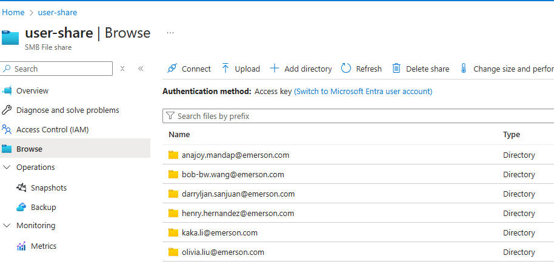
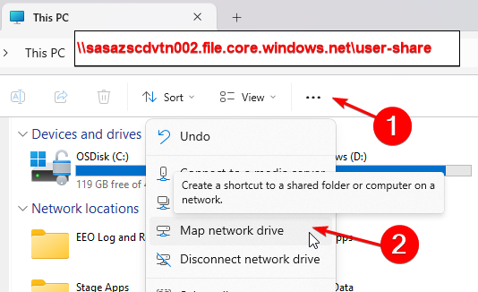
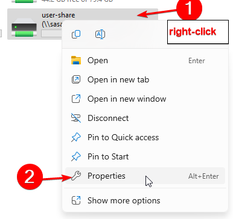
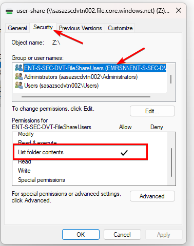
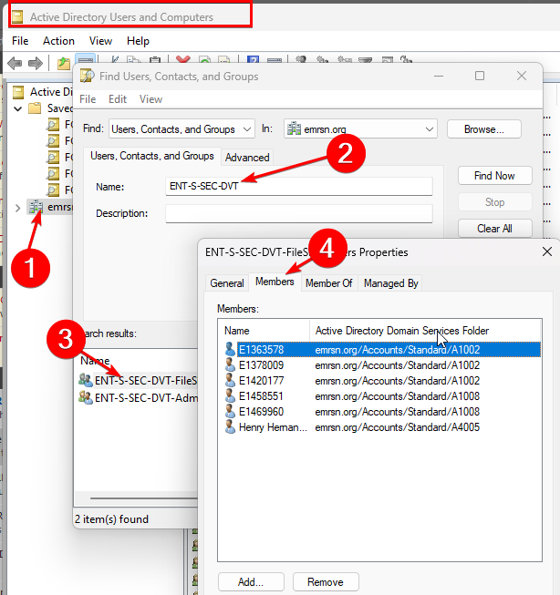
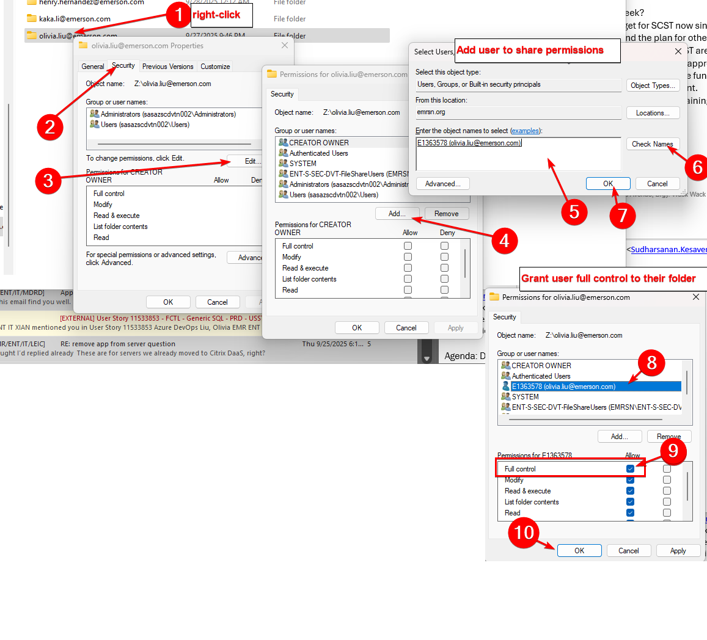

# 1. DVT Application: Create New User Guide

## 1.1. Create new user sql script
## Let's take adding olivia.liu@emerson.com as a user as an example
INSERT INTO user_info values (gen_random_uuid(), 'Olivia', 'Liu', 'olivia.liu@emerson.com', null, null, null, now(),'bob-bw.wang@emerson.com',  false);

## 1.2. Add related folders for user
### 1.2.1 Go to Azure Storage Account and Add a folder "olivia.liu@emerson.com" (Using user's email address).
https://portal.azure.com/#view/Microsoft_Azure_FileStorage/FileShareMenuBlade/~/browse/storageAccountId/%2Fsubscriptions%2F74b84c07-cb18-426c-ade1-b90aa8177075%2FresourceGroups%2Frg-z-corp-davalt-n-002%2Fproviders%2FMicrosoft.Storage%2FstorageAccounts%2Fsasazscdvtn002/path/user-share/protocol/SMB

### 1.2.2 Then enter folder "olivia.liu@emerson.com", add a new folder "Load Folder". 
### 1.2.3 Add a new folder "Log Folder".
### 1.2.4 Add a new folder "Production Folder".
### 1.3 Then go to Access control (IAM) and give the access to user.
### 1.3.1
First, map the shares as network drives on your computer. In my case, I chose Z drive for user share and Y for main share.

To set the permissions on the whole share

You can see that the users in the ENT-S-SEC-DVT-FileShareUsers group have access to view the folder contents

Here, you can see the members of the group. These users have access to view the contents of the folder. Any user in the system needs to be in this group

Then we need to set the permissions to the user's folder
